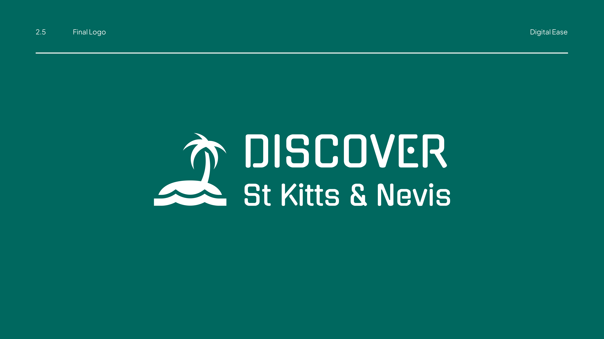

<div align="center">

  
  <br/>

  <h3><b>DISCOVER SKIN API</b></h3>

</div>

<!-- TABLE OF CONTENTS -->

# 📗 Table of Contents

- [📖 About the Project](#about-project)
  - [🛠 Built With](#built-with)
    - [Tech Stack](#tech-stack)
    - [Key Features](#key-features)
- [💻 Getting Started](#getting-started)
  - [Setup](#setup)
  - [Prerequisites](#prerequisites)
  - [Install](#install)
  - [Usage](#usage)
  - [Run tests](#run-tests)
- [👥 Authors](#authors)
- [🔭 Future Features](#future-features)
- [🤝 Contributing](#contributing)
- [⭐️ Show your support](#support)
- [🙏 Acknowledgements](#acknowledgements)
- [📝 License](#license)

<!-- PROJECT DESCRIPTION -->
# 📖 Discover Skin API <a name="about-project"></a>

**Discover Skin API** is a backend service that allows users to save and manage experiences they are interested in. Users can list, add, and remove saved experiences associated with their accounts. Users can book experiences for future events, such as vacations, concerts, or workshops.

## 🛠 Built With <a name="built-with"></a>

### Tech Stack <a name="tech-stack"></a>


<details>
  <summary>Framework</summary>
  <ul>
    <li><a href="https://adonisjs.com.org/">Adonisjs</a></li>
  </ul>
</details>

<details>
  <summary>Server</summary>
  <ul>
    <li><a href="https://nodejs.org/en/">Node.js</a></li>
  </ul>
</details>

<details>
<summary>Database</summary>
  <ul>
    <li><a href="https://www.postgresql.org/">PostgreSQL</a></li>
  </ul>
</details>

<details>
<summary>Authentication</summary>
  <ul>
    <li><a href="https://jwt.io/">JWT</a></li>
  </ul>
</details>

<details>
<summary>Testing</summary>
  <ul>
    <li><a href="https://japa.dev/">Japa</a></li>
  </ul>
</details>

<!-- Features -->

## Features
- **User Authentication**: Secure authentication using JWT.
- **Save Experiences**: Users can bookmark experiences for future reference.
- **Retrieve Saved Experiences**: Fetch a list of experiences saved by a user.
- **Delete Saved Experiences**: Remove an experience from a user's saved list.
- **Add Experience**: Vendor can add an experience to the database.
- **Update Experience**: Vendor can update an experience in the database.
- **Delete Experience**: Vendor can delete an experience from the database.
- **List Experiences**: Users can view a list of all available experiences.
- **Experience Details**: Users can view details of a specific experience.
- **Experience Ratings**: Users can rate an experience.


<p align="right">(<a href="#readme-top">back to top</a>)</p>

<!-- GETTING STARTED -->

## 💻 Getting Started <a name="getting-started"></a>


To get a local copy up and running, follow these steps.

### Prerequisites
- Node.js (v16+)
- PostgreSQL
- AdonisJS CLI

### Setup Instructions
1. **Clone the repository:**
   ```sh
   git clone https://github.com/danielochuba/discover-skin-api.git
   cd saved-experiences-api
   ```
2. **Install dependencies:**
   ```sh
   npm install
   ```
3. **Configure environment variables:**
   - Copy the `.env.example` file and rename it to `.env`.
   - Your `.env` file should include the following environment variables:
     - `SERVER_URL=http://localhost:3333/api/v1`
     - `DB_HOST=localhost`
     - `DB_PORT=your_db_port`
     - `DB_USER=your_db_user`
     - `DB_PASSWORD=your_db_password`
     - `DB_DATABASE=your_db_name`

   - Remember to create a databse in PostgreSQL with the name you specified in the `.env` file.
4. **Run database migrations:**
   ```sh
   node ace migration:run
   ```
5. **Start the server:**
   ```sh
   npm run dev
   ```
6. **Run tests:**
   ```sh
   node ace test
   ```

## API Endpoints
#### Base URL: `http://localhost:3333/api/v1`
### Authentication
| Method | Endpoint        | Description         |
|--------|----------------|---------------------|
| POST   | `/users/auth/login`  | User login         |
| POST   | `/users/auth/register` | User registration  |
| POST   | `/users/auth/logout`   | User logout        |

#### User registration request object
```json
{
  "first_name": "John",
  "last_name": "Doe",
  "email": "example@emailcom",
  "password": "password",
}
```
#### User login request object
```json
{
  "email": "example@emailcom",
  "password": "password"
}
```

### Saved Experiences
| Method | Endpoint                                  | Description                         |
|--------|------------------------------------------|-------------------------------------|
| GET    | `/users/:id/saved-experiences`           | List all saved experiences         |
| POST   | `/users/:id/saved-experiences`           | Save an experience                 |
| DELETE | `/users/:id/saved-experiences/:experienceId` | Remove a saved experience |

#### Saved experience request object
```json
{
  "user_id": 1,
  "experience_id": 1
}
```

### Experiences
| Method | Endpoint                                  | Description                         |
|--------|------------------------------------------|-------------------------------------|
| GET    | `/experiences`                           | List all experiences                |
| GET    | `/experiences/:id`                       | Get an experience                   |
| POST   | `/experiences`                           | Add an experience                   |
| PUT    | `/experiences/:id`                       | Update an experience                |
| DELETE | `/experiences/:id`                       | Delete an experience                |

#### Experience request object
```json
{
  "title": "Experience Title",
  "description": "Experience Description",
  "location": "Experience Location",
  "image": "http://example.com/image.jpg",
  "category_id": 1,
  "vendor_id": 1
}
```

### Experience Categories
| Method | Endpoint                                  | Description                         |
|--------|------------------------------------------|-------------------------------------|
| GET    | `/experience-categories`                            | List all categories                 |

#### Experience category request object
```json
{
  "title": "Experience Title",
  "image": "http://example.com/image.jpg",

}
```
#### Experience categories are currently seeded into the database.


### Experience Dates
| Method | Endpoint                                  | Description                         |
|--------|------------------------------------------|-------------------------------------|
| GET    | `/experience-dates/`                 | List all dates for an experience    |
| POST   | `/experience-date/`                 | Add a date for an experience        |
| DELETE | `/experience-date/:id`              | Delete a date for an experience     |
| PUT    | `/experience-date/:id`              | Update a date for an experience     |

#### Experience dates request object
```json
{
  "experience_id": 1,
  "date": "2022-12-25",	
  "start_time": "12:00 PM",
  "end_time": "2:00 PM",
  "max_spots": 10,
  "spots_reserved": 0,
  "price": 100.00
}
```


### Ratings
| Method | Endpoint                                  | Description                         |
|--------|------------------------------------------|-------------------------------------|
| POST   | `/experience-feedbacks`               | Rate an experience                  |

#### Experience Ratings request object
```json
{
  "experience_id": 1,
  "user_id": 1,
  "rating": 5,
  "comment": "Great experience!"
}
```

## Experience Booking
| Method | Endpoint                                  | Description                         |
|--------|------------------------------------------|-------------------------------------|
| POST   | `/experiences/:id/bookings`              | Book an experience                  |
| GET    | `/users/:id/bookings`                    | List all bookings                   |
| DELETE | `/users/:id/bookings/:bookingId`         | Cancel a booking                    |

#### Experience Booking request object
```json
{
    "experience_id": 1,
    "user_id": 1,
    "price": 100.00,
    "status": "pending",
    "spots_reserved": 2,
    "voucher": "ABC123"
}
```

## Vendor
| Method | Endpoint                                  | Description                         |
|--------|------------------------------------------|-------------------------------------|
| GET    | `/vendors`                               | List all vendors                    |


#### Vendor response object
```json
{
  "first_name": "John",
  "last_name": "Doe",
  "headline": "Experience Vendor",
  "about": "I am a vendor",
  "image": "http://example.com/image.jpg"
  
}
```
#### Vendors are currently seeded into the database. 


## Testing
To ensure that the API works correctly, run tests with:
```sh
npm ace test
```

## Contribution
Contributions are welcome! Please follow these steps:
1. Fork the repository.
2. Create a new branch (`feature-branch`).
3. Commit your changes (`git commit -m 'Add feature'`).
4. Push to the branch (`git push origin feature-branch`).
5. Open a pull request.


<p align="right">(<a href="#readme-top">back to top</a>)</p>

<!-- AUTHORS -->

## 👥 Author <a name="authors"></a>

👤 **Daniel Ochuba**


- GitHub: [@danielochuba](https://github.com/danielochuba)
- Twitter: [@daniel_ochuba](https://x.com/daniel_ochuba)
- LinkedIn: [daniel-ochuba-ugochukwu](https://linkedin.com/in/daniel-ochuba-ugochukwu)


<!-- FUTURE FEATURES -->

## 🔭 Future Features <a name="future-features"></a>
- [ ] **2Checkout Backend Implementation**
- [ ] **User Profile**
- [ ] **Vendor Profile**
- [ ] **User Dashboard**
- [ ] **Vendor Dashboard**


<p align="right">(<a href="#readme-top">back to top</a>)</p>

<!-- CONTRIBUTING -->

## 🤝 Contributing <a name="contributing"></a>

Contributions, issues, and feature requests are welcome!

Feel free to check the [issues page](https://github.com/danielochuba/discover-skin-api/issues/).

<p align="right">(<a href="#readme-top">back to top</a>)</p>

<!-- SUPPORT -->

## ⭐️ Show your support <a name="support"></a>

If you like this project give it a star

<p align="right">(<a href="#readme-top">back to top</a>)</p>

<!-- ACKNOWLEDGEMENTS -->

## 🙏 Acknowledgments <a name="acknowledgements"></a>


I would like to thank Discover skin following for their support and inspiration:

<p align="right">(<a href="#readme-top">back to top</a>)</p>

<!-- LICENSE -->

## 📝 License <a name="license"></a>

This project is [MIT](./LICENSE) licensed.

<p align="right">(<a href="#readme-top">back to top</a>)</p>
